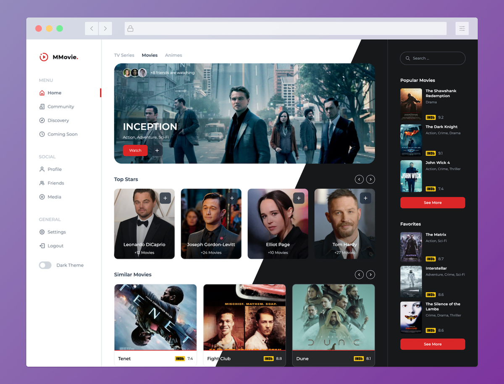

# Movie Information System

A comprehensive movie information system designed with Tailwind CSS and Alpine.js. This system features both light and dark themes with a dynamic theme switcher. It includes a full-featured login system and retrieves real-time movie information through APIs.

## Screenshots



## Features

- **Responsive Design**: Adapts to both light and dark themes.
- **Dynamic Theme Toggler**: Switch between light and dark modes using a theme switcher integrated with Alpine.js v3.
- **Login System**: Secure login functionality for user access.
- **Real-Time Movie Information**: Fetch and display up-to-date movie data using external APIs.

## Installation & Development

To get started with development, first, install the necessary dependencies for Tailwind CSS and Node.js using npm:

```bash
npm install
